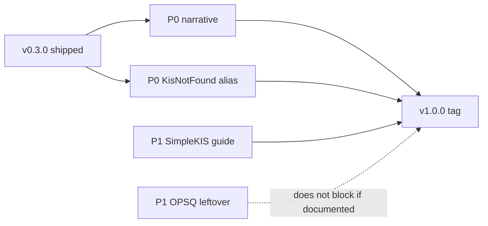

# v0.3.0 → v1.0.0 전 코드·문서 리뷰

**작성일**: 2026-09-05
**시점**: 태그 `v0.3.0` (PyPI 게시됨). `#30` · `#33`–`#36` 닫힘.
**범위**: SimpleKIS 예제 필요 여부, 1.0.0 태그 전 보강점.
**하지 않은 것**: 이슈 개설, 코드 패치, `v1.0.0` 태그, 주문·웹소켓 실측.

이 문서는 동결 분석입니다. 작업 목록은 GitHub Issues 입니다.

---

## 요약

1. **`SIMPLEKIS_GUIDE`용 예제 파일은 지금 추가하지 않는다.** 가이드가
   [`src/vmkis/simple.py`](../../src/vmkis/simple.py)와 어긋난다. 가이드를
   맞춘 뒤에야 `01_basic`에 선택적으로 한 파일을 검토한다.
2. **`v1.0.0`은 폴백 코드를 다시 지우는 일이 아니다.** 그 코드는 이미
   `v0.3.0`에 있다. 태그의 뜻은 SemVer major 선언, 남은 “1.0.0에서 제거”
   예고 정리, 문서 정직성이다.
3. 태그 전 P0는 **문서 내러티브**(0.3.0 Breaking vs “1.0.0 대기”),
   **Stable vs 0.x Breaking 이중 메시지**, **`KisNotFoundError` 별칭**이다.

---

## 1. SimpleKIS — 예제 파일이 필요한가

### 판정

**아니오.** 지금은 파일을 늘리지 않는다.

### 근거

| 항목 | 사실 |
|---|---|
| `examples/` 의 `SimpleKIS` | **0건** (전체 트리 검색) |
| Tutorial 표면 | `examples/01_basic/` — `create_client` · `kis.stock` / `kis.account` |
| 가이드가 가리키는 예제 | `SIMPLEKIS_GUIDE.md` 끝 — `examples/01_basic/` (VmKis 예제) |
| 커리큘럼 폴더 | `02`/`03` 삭제됨 (`#155`). 부활하지 않음 |

### 가이드 vs `simple.py`

| 가이드 주장 | 코드 |
|---|---|
| `place_order(..., side="buy"\|"sell")` | `place_order(symbol, qty, price=None)` — **항상 매수** |
| `cancel_order(order_id="…")` → bool | `cancel_order(order_obj)` → `order.cancel()` |
| `price.change_rate` | quote 쪽은 `rate` 등 (가이드 필드명과 불일치) |
| `balance.total_assets` / `revenue` / `revenue_rate` | `amount`/`profit`/`profit_rate`, `deposits`는 dict |
| `order.order_id` | 주문 식별은 `number` 계열 |

가이드 스니펫을 그대로 돌리면 실패한다. 가이드를 따르는 예제 파일을
만들면 깨진 데모가 되고, `simple.py`에 맞춘 예제를 만들면 가이드와
모순된다.

### 권고

1. **먼저** [`docs/SIMPLEKIS_GUIDE.md`](../SIMPLEKIS_GUIDE.md)를
   `simple.py`에 맞게 축소하거나, API를 가이드에 맞게 넓힌다 (둘 중 하나).
2. 정합 뒤에만 선택적으로
   `examples/01_basic/simplekis_get_price.py` (시세·잔고 한 파일)를 검토한다.
3. 모니터 루프·조건부 매매·ThreadPool·매도/취소 전용 파일은 API/문서가
   같아진 뒤에만.

---

## 2. 이미 `v0.3.0`에 들어간 것

| 트랙 | 근거 |
|---|---|
| `#30` 구조 | 허브-스포크 + 얇은 파사드 + `fetch()` — `ARCHITECTURE.md` §1.0 |
| `#30` 현물 예제 | `01_basic` + `#150`/`#152`/`#155` |
| `#30` 동작(시세·연결) | `#157` 필수 연기 6개 exit 0. 잔고·계좌는 필수 아님 |
| `#33`–`#34` | `PyKis` · `~/.pykis` · `PYKIS_*` · 루트→types 위임 제거 |
| `#35` | `Development Status :: 5 - Production/Stable` |
| `#36` | MIGRATION · 안정성 정책 · CHANGELOG Breaking |
| `#100` | **B** (수요 기반 TR, 전량 codegen 없음) — 1.0 블로커 아님 |

게시: [PyPI 0.3.0](https://pypi.org/project/vm-stock-kis/0.3.0/),
[Release v0.3.0](https://github.com/visualmoney/vm-stock-kis/releases/tag/v0.3.0).

---

## 3. 갭 (우선순위)

### P0 — 지금 태그하면 약한 것

| # | 항목 | 증거 |
|---|---|---|
| 1 | Breaking·Stable이 **0.3.0**인데 문서가 “1.0.0 대기/제거”로 말함 | `API_STABILITY_POLICY.md`, `MIGRATION_GUIDE.md` §4 |
| 2 | Stable 약속 vs “0.x는 minor도 Breaking” · FAQ `<1.0.0` 핀 | `API_STABILITY_POLICY.md` §1.1 / Q2, `FAQ.md` |
| 3 | 살아 있는 “1.0.0에서 제거” — `client.exceptions.KisNotFoundError` | `src/vmkis/client/exceptions.py` (~307–325) |

### P1 — 제품 신뢰

| # | 항목 | 증거 |
|---|---|---|
| 4 | SIMPLEKIS_GUIDE ↔ `simple.py` | 위 §1 |
| 5 | paper `get_balance` / `account_lookups` → `OPSQ2000` | `docs/dev_logs/2026-09-05_36`–`39_*.md`, smoke 목록 제외 |
| 6 | `next-up` 비어 있음 | `gh issue list --label next-up` — 착수 전 재대기 |

### P2 — 다듬기

| # | 항목 | 증거 |
|---|---|---|
| 7 | `PYPI_RELEASE.md` 낡은 예시(미등록·v2.2.0) | `docs/guidelines/PYPI_RELEASE.md` |
| 8 | 영문 문서 최소 (`#104`) | `docs/INDEX.md` English, `docs/user/en/README.md` |
| 9 | 1.0 노트에 `#100` B · 현물만 · `fetch()` 재고지 | README, EXTENDING_API |

---

## 4. 권고 작업 목록 (이슈 초안 제목)

개설은 이 보고서 **승인 후** 별 세션. `next-up` 최대 3.

1. `docs(release): 0.3.0 Breaking을 1.0.0 대기처럼 쓰지 않게`
   — 정책·마이그레이션·FAQ 핀 문구를 태그 실측과 맞춤.
2. `docs(policy): v1.0.0 이 약속하는 SemVer 한 줄`
   — Stable과 “0.x Breaking”이 같이 서지 않게.
3. `fix(exceptions)!: client.KisNotFoundError 별칭 제거`
   — 마지막 “1.0.0에서 제거” 예고.
4. `docs(simple): SIMPLEKIS_GUIDE 를 simple.py 에 맞춤`
   — 예제 파일보다 먼저.
5. `test/docs(examples): paper 잔고 OPSQ2000 정리 또는 CANO 안내`
   — 필수 연기는 그대로 두되 leftover를 닫거나 문서화.
6. `docs(release): PYPI_RELEASE 를 0.3.0 이후로`
7. `chore(tracker): 1.0.0 next-up 재대기 (최대 3)`
8. `docs(1.0 notes): #100 B · 현물 · fetch() 재고지`

---

## 5. 태그 조건 (한 줄)

**P0 세 줄(내러티브 · Stable/0.x · KisNotFound 별칭)이 코드·살아 있는 문서에
맞고, P1 SimpleKIS 가이드가 `simple.py`와 같을 때 `v1.0.0`을 찍는다.**
잔고 OPSQ는 필수 연기 밖이면 문서 leftover로 남겨도 태그를 막지 않는다.
`#33`–`#36` 코드를 다시 지울 필요는 없다.

---

## 참고

- 탐색: SimpleKIS vs examples · 0.3→1.0 갭 (2026-09-05 세션)
- 선행 동결: [ARCHITECTURE_REVIEW](2026-09-05_ARCHITECTURE_REVIEW.md),
  [dev_logs/2026-09-05_42_v030_tag.md](../dev_logs/2026-09-05_42_v030_tag.md)
